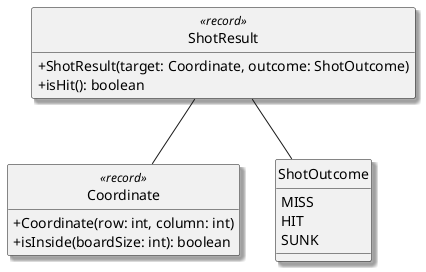
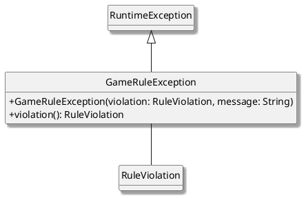

# Guida agli schemi UML del progetto

Questo file stabilisce come realizzare gli schemi UML del progetto in modo coerente con le slide del corso e con il modello della relazione. Gli esempi usano PlantUML.

## 1. Regola fondamentale

Ogni simbolo deve descrivere una relazione reale del progetto. La notazione non va scelta per ottenere un effetto grafico.

- Il diagramma deve avere uno scopo preciso.
- Devono comparire soltanto gli elementi necessari a quello scopo.
- Ogni elemento inserito deve essere collegato al resto dello schema.
- Il diagramma deve essere spiegato nel testo della relazione.
- I dettagli devono aumentare gradualmente passando dall'analisi al design.
- Un pattern va indicato soltanto se è realmente implementato e motivato.

La relazione tipo richiede pochi UML mirati e leggibili, non un unico schema contenente tutto il progetto.

## 2. Tipi di diagramma nella relazione

### 2.1 Modello del dominio - sezione 1.2

Scopo: descrivere il problema, le entità principali e i loro rapporti, senza mostrare come il software è implementato.

Inserire:

- concetti del dominio;
- operazioni pubbliche essenziali;
- associazioni, aggregazioni e composizioni significative;
- eventuali generalizzazioni proprie del dominio.

Non inserire:

- classi `Impl`;
- Controller, View o librerie grafiche;
- campi e metodi privati;
- strutture dati interne;
- eccezioni Java;
- pattern non ancora implementati;
- dettagli di Gradle, JUnit o Java.

Nel progetto Battleship questo è il diagramma generale con concetti come `Game`, `Player`, `Board`, `Ship`, `Shot`, `Sonar`, `Coordinate` e i risultati delle azioni.

### 2.2 Schema architetturale - sezione 2.1

Scopo: mostrare le parti principali del software e il modo in cui comunicano.

Quando l'architettura sarà implementata, mostrare soltanto:

- punti d'ingresso principali di Model, View e Controller;
- interfacce che separano i componenti;
- dipendenze fra i componenti;
- direzione delle comunicazioni rilevanti.

Evitare classi secondarie, campi interni e metodi che non servono a comprendere l'architettura.

### 2.3 Design dettagliato - sezione 2.2

Scopo: spiegare la soluzione adottata per un problema progettuale specifico.

Ogni sottosezione deve contenere:

1. il problema;
2. la soluzione e le alternative considerate;
3. vantaggi e costi della scelta;
4. un piccolo UML focalizzato;
5. il pattern utilizzato, soltanto se esiste realmente nel codice.

Qui possono comparire classi concrete, record, enum, eccezioni e implementazioni di interfacce, ma soltanto se pertinenti alla soluzione descritta.

## 3. Elementi dei riquadri

Le slide sui class diagram prevedono un riquadro diviso, quando necessario, in nome, campi e operazioni.

### Visibilità 

| Simbolo | Significato |
| --- | --- |
| `+` | pubblico |
| `-` | privato |
| `#` | protetto |
| `~` | visibilità di package |

Firma di un metodo:

```text
+nome(argomento: Tipo): TipoRestituito
```

Esempio:

```plantuml
class Coordinate <<record>> {
    +Coordinate(row: int, column: int)
    +isInside(boardSize: int): boolean
}
```

Nel modello del dominio mostrare normalmente soltanto la parte pubblica essenziale. I campi privati sono ammessi solo in un UML di design quando sono indispensabili a capire la soluzione.

### Tipi principali

```plantuml
interface Board {
    +shoot(target: Coordinate): ShotResult
}

class BoardImpl

abstract class AbstractShip

enum ShotOutcome {
    MISS
    HIT
    SUNK
}

class ShotResult <<record>> {
    +ShotResult(target: Coordinate, outcome: ShotOutcome)
    +isHit(): boolean
}
```

## 4. Relazioni UML

### 4.1 Associazione - "usa" o "conosce"

Una classe è collegata a un'altra, senza una relazione forte parte-tutto.

```plantuml
ShotResult -- Coordinate
GameRuleException -- RuleViolation
```

Usare una freccia soltanto quando è utile indicare la navigabilità o la direzione della conoscenza:

```plantuml
Controller --> Game
```

Non usare una freccia direzionale soltanto perché sembra graficamente più chiara.

### 4.2 Aggregazione - relazione parte-tutto debole

Il rombo vuoto si colloca dalla parte del tutto. La parte può avere una vita propria indipendente dal contenitore.

```plantuml
Game o-- Player
```

Si legge: `Game` aggrega `Player`.

### 4.3 Composizione - relazione parte-tutto forte

Il rombo nero si colloca dalla parte del tutto. La parte appartiene al tutto ed è concettualmente legata al suo ciclo di vita.

```plantuml
Player *-- Board
Board *-- Ship
TurnResult *-- ShotResult
```

Si legge, per esempio: `TurnResult` è composto da `ShotResult`.

Non usare la composizione automaticamente per ogni campo Java. Deve esistere una vera relazione "è composto da" nel modello considerato.

### 4.4 Ereditarietà o generalizzazione - relazione "è un tipo di"

La linea è continua e il triangolo vuoto punta verso la classe più generale.

```plantuml
RuntimeException <|-- GameRuleException
```

Si legge: `GameRuleException` è una sottoclasse di `RuntimeException`.

Il triangolo di generalizzazione deve rimanere vuoto. In alcune slide la punta appare nera per lo stile grafico usato, ma PlantUML applica la notazione UML standard con il triangolo vuoto.

### 4.5 Realizzazione di un'interfaccia - `implements`

La linea è tratteggiata e il triangolo vuoto punta verso l'interfaccia.

```plantuml
Board <|.. BoardImpl
```

Si legge: `BoardImpl` implementa `Board`.

Non confondere:

```plantuml
' extends: linea continua
RuntimeException <|-- GameRuleException

' implements: linea tratteggiata
Board <|.. BoardImpl
```

### 4.6 Dipendenza temporanea

Una classe usa un'altra, per esempio come parametro o servizio, ma non la conserva necessariamente come parte del proprio stato.

```plantuml
GameController ..> Game
```

La dipendenza usa una linea tratteggiata con freccia aperta.

### 4.7 Molteplicità 

Le molteplicità si aggiungono soltanto quando sono certe e aiutano a comprendere il modello.

```plantuml
Game "1" o-- "2" Player
Board "1" *-- "8" Ship
TurnResult "1" *-- "1..2" ShotResult
```

Valori comuni:

| Notazione | Significato |
| --- | --- |
| `1` | esattamente uno |
| `0..1` | zero oppure uno |
| `*` o `0..*` | zero o più |
| `1..*` | uno o più |
| `2` | esattamente due |

Se la molteplicità rende il diagramma più pesante senza aggiungere informazioni utili, può essere omessa.

## 5. Come scegliere la relazione

Usare queste domande nell'ordine:

1. `B` è un tipo particolare di `A`? Usare generalizzazione.
2. Una classe concreta implementa un'interfaccia? Usare realizzazione.
3. `B` è una parte essenziale e posseduta da `A`? Usare composizione.
4. `A` raggruppa `B`, ma `B` può vivere autonomamente? Usare aggregazione.
5. `A` conosce o usa stabilmente `B`? Usare associazione.
6. `A` usa `B` solo temporaneamente? Usare dipendenza.

Esempi del progetto:

| Relazione | Scelta | Motivo |
| --- | --- | --- |
| `GameRuleException` - `RuntimeException` | ereditarietà | la prima è un tipo della seconda |
| `BoardImpl` - `Board` | realizzazione | la classe implementa l'interfaccia |
| `TurnResult` - `ShotResult` | composizione | il risultato del turno è formato dagli esiti dei bersagli |
| `GameRuleException` - `RuleViolation` | associazione | l'eccezione conserva la causa semantica, ma l'enum non dipende dal suo ciclo di vita |
| `ShotResult` - `Coordinate` | associazione | la coordinata è un valore autonomo riutilizzabile |

## 6. UML corretti fino al punto 1.6 della guida

Fino a questa fase non è ancora stato applicato alcun pattern GoF. I due schemi di design devono quindi descrivere value object, risultati ed eccezioni senza dichiarare Strategy, Template Method, Decorator o Observer.

### 6.1 Risultato di un singolo bersaglio



Le relazioni sono associazioni: `Coordinate` e `ShotOutcome` sono valori autonomi, non parti il cui ciclo di vita dipende da `ShotResult`.

### 6.2 Violazioni delle regole



Il triangolo vuoto rappresenta l'ereditarietà da `RuntimeException`; la linea semplice verso `RuleViolation` rappresenta l'associazione con la causa della violazione.

## 7. Pattern da aggiungere soltanto nelle fasi successive

La guida del progetto introduce in seguito:

- Strategy per `ShotStrategy`, `NormalShotStrategy` e `DoubleShotStrategy`;
- un piccolo Template Method nel comportamento comune di `ShotStrategy`;
- Decorator per la policy che rende il sottomarino non rilevabile dal sonar;
- Observer per la comunicazione delle intenzioni dalla View al Controller;
- MVC come pattern architetturale, che non fa parte dei 23 pattern GoF.

Questi elementi vanno inseriti nella relazione e negli UML solo dopo essere stati realmente implementati. Per ogni pattern occorre indicare il problema, i ruoli delle classi del progetto, la soluzione e le conseguenze positive e negative.

## 8. Regole di leggibilità in PlantUML

Configurazione di base consigliata:

```plantuml
@startuml NomeDiagramma

!pragma layout smetana

skinparam monochrome true
skinparam shadowing true
skinparam classAttributeIconSize 0
hide circle
hide empty fields

' elementi e relazioni

@enduml
```

Per guidare la disposizione senza cambiare il significato UML:

```plantuml
Shot -left- Game
Game -right- Sonar
Shot -[hidden]right- Game
```

Le indicazioni `left`, `right`, `up`, `down` e le relazioni `hidden` servono soltanto al layout. Non trasformano un'associazione in ereditarietà , aggregazione o composizione.

Evitare `skinparam linetype ortho` e `skinparam linetype polyline` quando si desiderano collegamenti continui e il più possibile rettilinei.

## 9. Errori da evitare

- Usare un rombo o un triangolo soltanto per imitare l'aspetto di un altro diagramma.
- Disegnare una freccia di ereditarietà al contrario: il triangolo punta sempre al tipo più generale.
- Usare una linea continua per `implements`: deve essere tratteggiata.
- Confondere composizione con ereditarietà .
- Inserire una classe senza collegamenti con il resto dello schema.
- Mostrare tutte le classi, tutti i campi e tutti i metodi in ogni UML.
- Inserire elementi implementativi nel modello del dominio.
- Dichiarare un pattern che non esiste nel codice.
- Usare Singleton soltanto perché nel gioco esiste una singola partita corrente.
- Aggiungere relazioni invisibili e attribuire loro un significato UML.
- Usare nomi o firme diversi da quelli realmente presenti nel progetto senza spiegare il diverso livello di astrazione.

## 10. Checklist prima di inserire un UML nella relazione

- [ ] Lo scopo del diagramma è dichiarato nel testo.
- [ ] Il livello è corretto: dominio, architettura oppure design dettagliato.
- [ ] Ogni riquadro è pertinente allo scopo.
- [ ] Non ci sono elementi isolati.
- [ ] Il triangolo punta alla superclasse o all'interfaccia.
- [ ] `extends` usa una linea continua.
- [ ] `implements` usa una linea tratteggiata.
- [ ] Il rombo è collocato dalla parte del tutto.
- [ ] Composizione e aggregazione sono motivate dal dominio.
- [ ] Le molteplicità inserite sono corrette.
- [ ] Le firme mostrate corrispondono al livello del diagramma.
- [ ] I dettagli privati non necessari sono stati omessi.
- [ ] Gli eventuali pattern citati esistono realmente nel codice.
- [ ] Il diagramma è leggibile in bianco e nero.
- [ ] La figura ha numero, didascalia ed è richiamata nel testo.

## 11. Riferimenti teorici usati

- Slide 1: composizione ed ereditarietà come forme di riuso.
- Slide 6, in particolare le parti su composizione, class diagram e interfacce: associazione, composizione, generalizzazione, molteplicità e realizzazione di `implements`.
- Slide 8: polimorfismo e uso corretto delle gerarchie.
- Slide 12: gerarchia delle eccezioni Java e sottoclassi di `RuntimeException`.
- Slide 15: separazione MVC e comunicazione fra View e Controller.
- Slide 20: descrizione e applicazione dei design pattern.
- Relazione tipo: distinzione fra modello del dominio, schema architetturale e piccoli UML di design dettagliato.
- [Documentazione PlantUML sui class diagram](https://plantuml.com/class-diagram): sintassi delle relazioni, molteplicità , direzioni e collegamenti nascosti.
- [Documentazione PlantUML sui motori di layout](https://plantuml.com/layout-engines): uso di Smetana mediante `!pragma layout smetana`.

Questi riferimenti definiscono il significato delle relazioni. Lo stile grafico può variare fra le slide, ma non deve cambiare la semantica UML.
